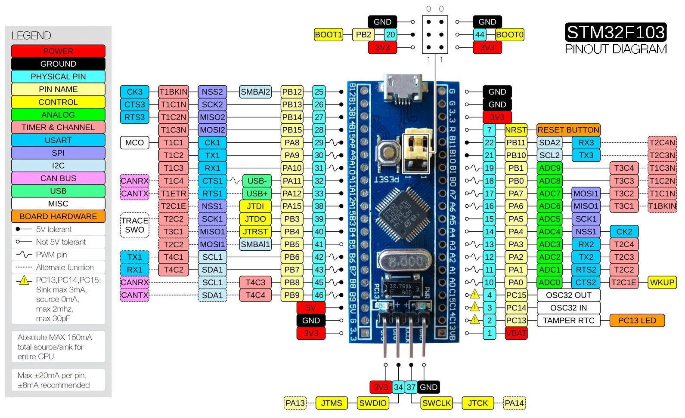

# Sistemas Embebidos

Este repositorio contiene todos los trabajos practicos realizdos para la curzada de Sistemas Embebidos.

## Trabajos Practicos

Algunos de caracter obligatorio, otros como guias de practica. Estos son los trabajos practicos:
1. 
2. Linker Script
3. Startup Script
4. ADC
5. PWM & UART
6. FSM & UART RX-TX
7. TP Final - Ajedrez

## Trabajo Practico final

El trabajo practico final tiene como fin la integracion de todos los contenidos de la materia.

## Herramientas

Para esta curzada utilizamos el microprocesador [STM32F103C8T6](https://www.st.com/resource/en/datasheet/stm32f103cb.pdf), con diferentes componentes externos. Todos los programas estan escritos en C compilados con la [toolchain GNU de ARM](https://developer.arm.com/downloads/-/gnu-rm), automatizados con Makefile y flasheados directamente sobre la placa.
Como editor de texto / IDE se utilizo VS Code y para debuggear se utilizo [Open Source Tools for ST-Link](https://github.com/stlink-org/stlink) y la extension de VS Code [Cortex Debug](https://marketplace.visualstudio.com/items?itemName=marus25.cortex-debug). Cabe aclarar que los archivos de proyecto de VS Code estan pensados para un ambiente de desarrollo basado en Linux aunque facilmente podrian ser adaptados a Windows.

## Pinout

