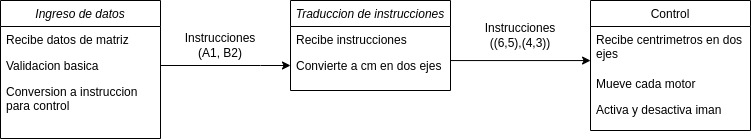
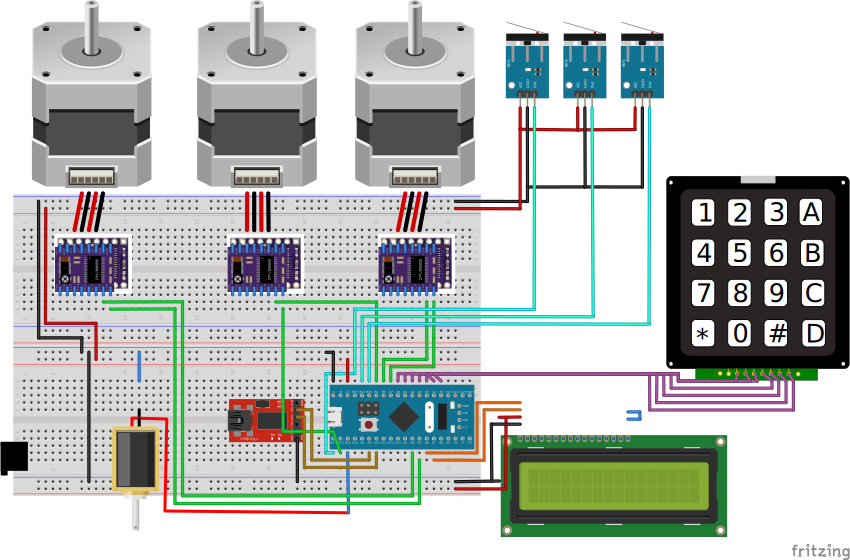

# Trabajo Practico Final

## Scope

En este proyecto, implementaremos un sistema de control que movera piezas de ajedrez a traves del uso de motores y electroimanes.

## Implementacion

### Movimiento

Para mover las piezas del tablero de ajedrez (que tendran un metal incrustado), utilizaremos motores en 3 ejes y un electroiman para levantarlas.

### Control

Para insertar los movimientos que queremos realizar utilizaremos un pad numerico que funcionara como los teclados numericos de los celulares.

Para facilitar el ingreso de datos, utilizaremos el LCD para ir mostrando la el comando.

### Procesamiento de movimientos

Una vez recibido el movimiento a realizar, enviaremos este movimiento a un sistema de procesamiento externo a traves de UART, donde se determinara si el movimiento es valido. Si es valido, devolvera un movimiento que el BluePill pueda interpretar para realizar dicho movimiento. Ademas, en todo momento, el sistema externo almacenara el estado del tablero.

## Entregas parciales
### Entrega 1

Para esta primera entrega, se debera lograr ingresar comandos (que no tendran validacion), mostrarlos en LCD, y los motores deberan moverse para lograr llevar la pieza de un casillero a otro.

### Diagrama funcional

### Vista de Breadboard

### Entrega 2

En la segunda entrega se debera poder validar movimientos y llevar una logica de juego.

### Entrega 3

Para la entrega final, se podra controlar remotamente los movimientos a realizar en el tablero.