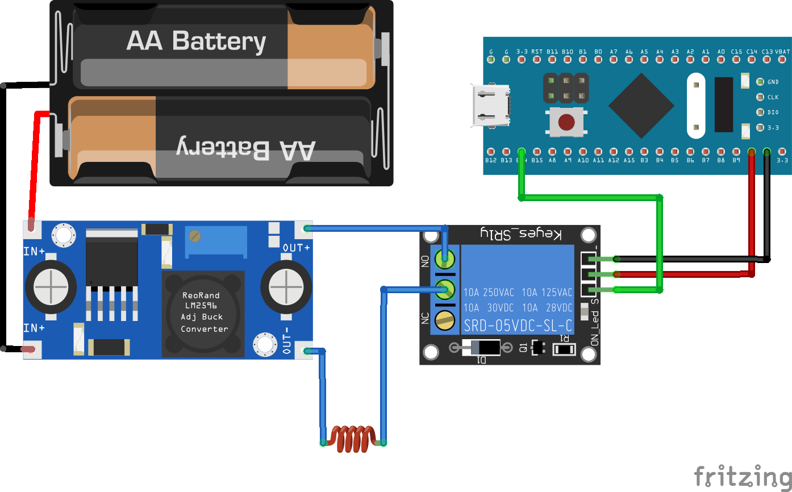
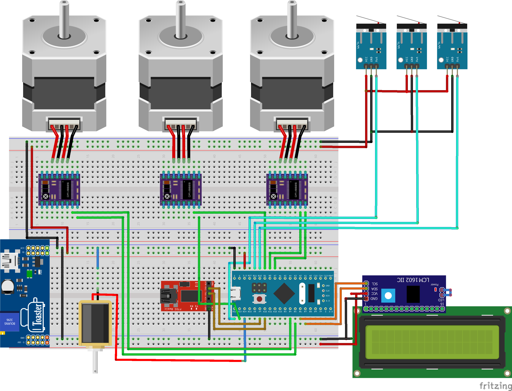
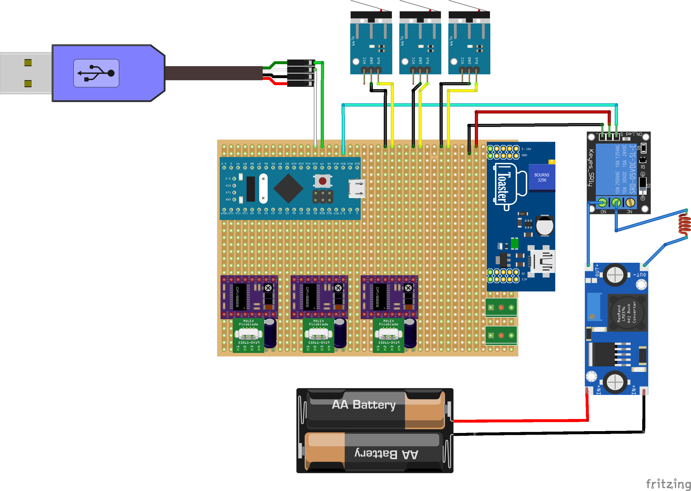
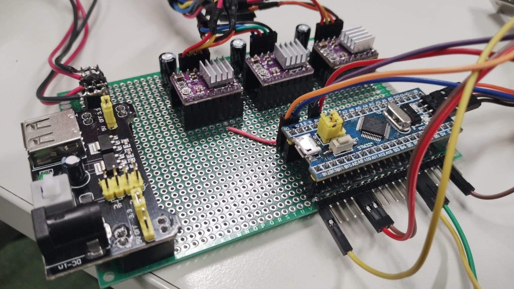
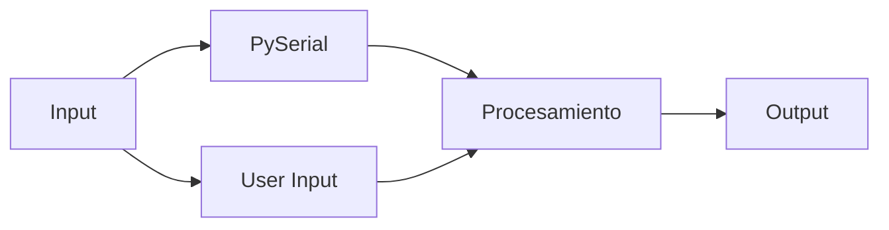
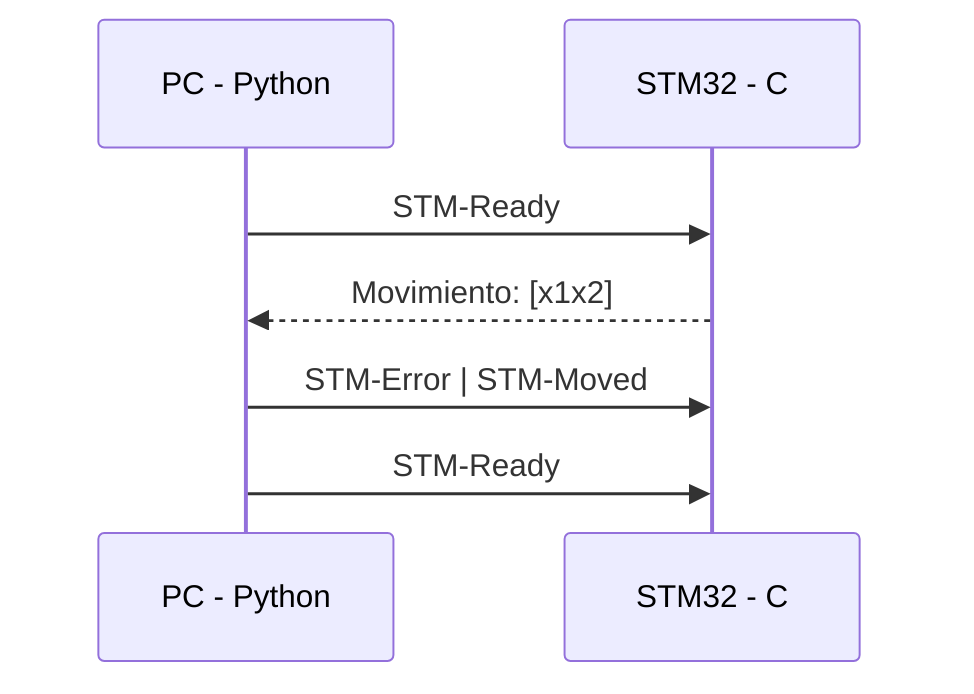
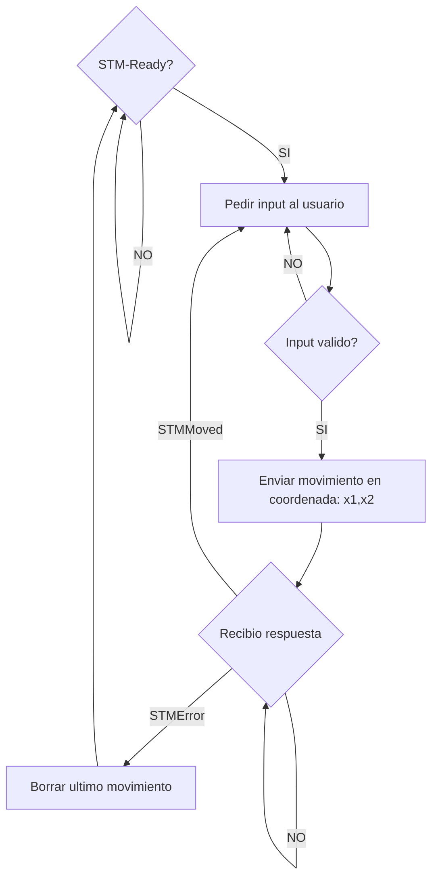

# Trabajo Practico Final

## Introduccion

El ajedrez es un juego milenario que ha fascinado a jugadores de todas las edades y culturas. Su complejidad estratégica y la necesidad de tomar decisiones basadas en la evaluación de múltiples variables han llevado a los seres humanos a desafiar sus habilidades mentales a través de este apasionante juego.

A partir del avenimiento de la digitalizacion, y con el fin de compartir este grandioso juego con otras personas, se han diseñado muchas aplicaciones que nos permiten jugar remotamente a través de software con cualquier persona del mundo. En este caso nuestro enfoque es como llevar esa experiencia digital al mundo físico, creando un robot que cumpla esta función de mover las piezas como si la persona con la que jugamos se encontrara con nosotros.

En este informe, se detallarán los pasos seguidos para diseñar y construir dicho, así como los desafíos encontrados durante el proceso y las soluciones implementadas.

## Objetivo - Scope

El objetivo de este trabajo es lograr la implementacion de un sistema de juego completamente automatizado en el que a traves de nuestra computadora, podamos jugar al ajedrez con otra persona sin que ninguno de los dos necesite tocar ninguna pieza.

## Hardware

### ***STM32***
- STM32F103C8T6
El microprocesador utilizado durante toda la cursada, ideal para aplicaciones de control de este estilo.

### ***Motores, steppers, finales de carrera***
- x3 Pololu DRV8825
- x3 Leadshine Stepping Motor, bipolar, 1.8/stepp, 1,5A
- x3 Finales de carrera

Para el movimiento de nuestro robot se decidio el uso de motores paso a paso, debido a su presicion, velocidad y confiabilidad. Los mismos se controlan mediante un driver que le proporciona la corriente para excitar las bobinas y posee 3 conexiones con la placa: STEP, DIR. La primera recibe los pulsos para activar las bobinas (donde cada pulso equivaldra a 1 step), el segundo sera para diferenciar el sentido de giro.
Como se tienen ejes lineales y el motor tiene un movimiento radial, habra que convertir las vueltas del motor en movimiento lineal. Para ello se utilizo la siguiente formula de conversion: 

El motor tiene 360 grados, y cada paso del motor (step) equivale a 1.8. Es decir que para una vuelta completa de motor se tienen que ejecutar 200 stepps. Ademas el movimiento se logra con un tornillo acme de 4 hilos, con un avance de 8mm por vuelta. Entonces queda:

> 1 vuelta de tornillo --> 8mm de avance

> 1 vuelta de tornillo --> 200 pasos

> 200 pasos/8mm = 25 pasos/mm

Teniendo en cuenta esto, se creo una función que recibe como parámetro la dirección y cantidad de mm y esta le envía al motor hacia donde cuanto deberá moverse.

Lo ultimo que se hizo es mediante los finales de carrera, *settear* las coordenadas [0,0,0] de la maquina, para tener noción del espacio.

Los finales de carrera, como son *pushbuttons* físicos, al presionar el botón se puede obtener falsos positivos, por ruido o en la transición de 0 a 1. Por eso se debió crear una rutina de lectura de entradas con *debounce*. Donde se espera que la lectura sea la misma en 4 veces consecutivas para que sea contabilizado como un cambio en el estado del botón.

### ***Electroiman + Alimentacion externa***

- Electroiman
- Modulo Rele con transistor y diodo
- Fuente step-down XL4015, tension regulabre 1.35V-48V, Corriente regulable 0A-5A

Para levantar las piezas de ajedrez se decidió optar por un electroiman en la punta del CNC y arandelas incrustadas en las piezas.

Se analizaron distintas opciones pero se termino optando por hacer uno a través de un bobinado simple y la utilización de un pequeño modulo para limitar la corriente y aislar el sistema de potencia respecto del circuito de control.

El mismo consiste en una bobina de cobre esmaltado alrededor de un tornillo (también asilado). Al darle corriente a la bobina, debido al efecto del flujo de campo magnético a través de una espira, mediante Fahraday-Lenz, se magnetizas el tornillo para poder levantar la pieza.

Debido al alto consumo del electroiman (12V - 2A). Se creo un circuito externo para poder enviar la señal de 3.3V 20mA desde el micro al Electroiman, alimentado externamente con un a fuente step-down de 12V, con la corriente limitada por HW a 2A, a través de un rele en cascada con un transistor, para no sobrecargar la pata del micro.

### ***LCD + I2C***
- LCD1602A
- PCF8574

Conectaremos el display a través del modulo I2C con el fin de utilizar menos GPIO. En este display se mostrara información sobre las etapas del proceso con el fin de *debugguear* en caso de fallas en el sistema. Ademas sirve para mostrar información al usuario, como por ejemplo, que pieza selecciono, que pieza va a comer, etc.

### ***UART***
- CP2102

Componente necesario para interacción con el usuario a través de la terminal por serial e interacción con aplicación en Python para jugar al ajedrez. Se uso en modo RX y TX, con una velocidad de 9200 baudios.

| Pin STM32 | Mode |
| --- | ----------- |
| A10 | RX          |
| A9  | TX            |

## Montaje

### ***Pinout***

|              |        **Tipo de Pin**       | **I/O** | **Cantidad**  |            **Pin**           |
|:------------:|:----------------------------:|:-------:|:-------------:|:----------------------------:|
| LCD          | I2C                          |    O    |       2       | PB6, PB7                     |
| UART         | GPIO                         |   I/O   |       2       | PA9, PA10                    |
| 3x Stepper   | 3x GPIO - Dir 3x GPIO - Step |   O O   |      3 3 3    | PA7, PB13, PB5 PB0, PB1, PB4, A0, A1, A2 |
| 3x End-stops | GPIO                         |    I    |       3       | PB10, PB11, PB12             |
| Electroiman  | GPIO                         |    O    |       1       | PB14                         |

### ***Circuito***
Para comenzar lo montamos todo sobre una breadboard.

Las primeras entregas fueron enteramente en la *breadboard*, lo cual tuvo complicaciones como la manipulacion de altas corrientes en el electroiman y las tensiones superiores en la parte de los motores, llevando a quemar algunas pistas de la misma.

Debido a esto fue que se tomo la decision de pasar a un sistema mas fiable montado en una *perfboard*. Para esto, se migro el esquematico mostrado a sue equivalente soldado en una placa troquelada de la siguiente manera:

Finalmente, y siguiendo este esquematico, soldamos los componentes.

## Software

### ***C***
Todos los modulos que corren en el microprocesador, orientados al control, estan escritos en lenguaje C y se encuentran en este repositorio. El codigo fue mayormente desarrollado de manera propia, se utilizaron las siguientes librerias:
- [Libreria Standard de C](https://en.wikipedia.org/wiki/C_standard_library#:~:text=The%20C%20standard%20library%20or,is%20a%20superset%20of%20it.)
- [Librerias HAL de bajo nivel](https://deepbluembedded.com/stm32-hal-library-tutorial-examples/)

### ***Python***
Para conseguir una logica de juego continua, se decidio optar por el lenguaje Python que intefacea a traves de serial con el microprocesador.
- [PySerial](https://pyserial.readthedocs.io/en/latest/)
- [python-chess](https://python-chess.readthedocs.io/en/latest/)

### ***IDE & OS***
Como se menciona en el [README](/README.md) del repositorio, para todos los trabajos practicos se utilizo un entorno Linux, con las herramientas nativas: GCC para ARM, Make, Open Source tools for ST-LINK.

## Implementacion

Para comenzar con la implementacion primero se debe dividir el proceso en sus modulos funcionales. De esta manera, y utilizando principios de OOP, se puede luego implementar estos modulos funcionales como modulos logicos en C. Para ello se identifican los siguientes modulos:

- FSM (Finite State Machine) -> Responsable de orquestrar todos los procesos internos del programa, luego del set-up inicial, el programa iterara infinitamente sobre la FSM, que decidira que subprocesos ejecutar.
- Modulo LCD -> Modulo encargado del control del display LCD a traves de I2C.
- Modulo UART -> Las interacciones con el usuario y con la aplicacion de Python se realizara a traves de este modulo.
- Modulo Motores -> Como lo indica su nombre, controlara los motores, finales de carrera, electroiman, etc.

### ***Maquina de estados principal***

### ***Maquina de estados de movimientos***
Se trata de una secuencia de actividades simples.
1. Mover X para llegar al punto 1
2. Mover Y para llegar al punto 1
3. Mover Z hacia abajo para tomar la pieza
4. Mover Z hacia arriba para levantar la pieza
5. Mover X para llegar al punto 2
6. Mover Y para llegar al punto 2
7. Mover Z hacia abajo para dejar la pieza
8. Mover Z hacia arriba para seguir con la proxima operacion

### ***Protocolo serial***

Este simple protocolo desarrollado, se basa en 5 mensajes para la comunicacion de la siguiente manera:

## Desafios

Un primer desafio fue seguir con la decision de utilizar un flujo de programa no bloqueante en toda su magnitud. Esto trajo grandes problemas a la hora de *debugguear* pero que permite una mayor escalabilidad. Gracias a estas modificiaciones, se podria embeber en un RTOS o agregas otras funcionalidades que funciones en "paralelo", sin perjudicar el correcto funcionamieneto de lo que ya se tiene.

Otro desafío que tuvimos (un poco en sintonia con el anterior) fue poder diseccionar el proyecto y poder abarcarlo de a partes mas pequeñas sin perder de vista la funcionalidad macro. Al ser un proyecto ambicioso, a la hora de querer abordar los pequeños módulos, se podía perder un poco la vision general.

## Proximos pasos
Una vez terminado este trabajo, tuvimos ciertas ideas de como se puede mejorar este trabajo:
- Conexión de los pines *ENABLE* de los drives para poder apagar los motores en runtime.
- Antes de comer una ficha, debería mover la pieza a comer, fuera del tablero. Y luego mover la pieza seleccionada para que no haya colisiones.
- Creación de librerias propias, sin utilizacion de codigo externo.
- Implementacion de interfaz gráfica y juego a través de internet.

## Mas fotos
[Fotos](./Fotos)
