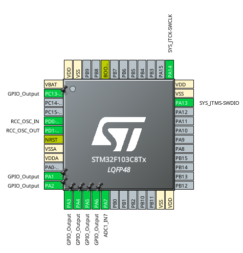

# Analog Digital Converter (ADC)
Medir una tensión analógica a intervalos constantes de tiempo y enviar el valor a un display alfanumérico.

## Consignas

1.  Configurar un pedido de interrupción (IRQ) de timer cada 0,5 segundos.
2.  En la rutina de servicio de interrupción (ISR) de dicha interrupción:
- invertir el estado de un LED indicador de sistema en funcionamiento.
- iniciar una conversión analógico-digital (ADC) mediante software. En esta se convertirá la tensión entregada por un potenciómetro a la entrada analógica.
3. Configurar un pedido de interrupción (IRQ) al finalizar la conversión del ADC.
4. En la rutina de servicio de interrupción (ISR) de dicha interrupción actualizar la variable que posteriormente se mostrará en el display.
5. En  el  bucle  infinito  de  main(),  implementar  la  rutina  de  formateo  y  envío  de mensaje hacia el display.El mensaje a mostrar será:

> CONVERSION ADC
> 
> x,xx V

Donde x,xx es el valor de la tensión medida con una unidad y dos decimales.Para el formateo del mensaje utilice sprintf() de la biblioteca estándar stdio.h.Para  el  envío  del  mensaje  se  requiere  que desarrolle  un  driver  de  display alfanumérico para interfaz paralelo de 4 bits.

## Diagramas
### Pinout
