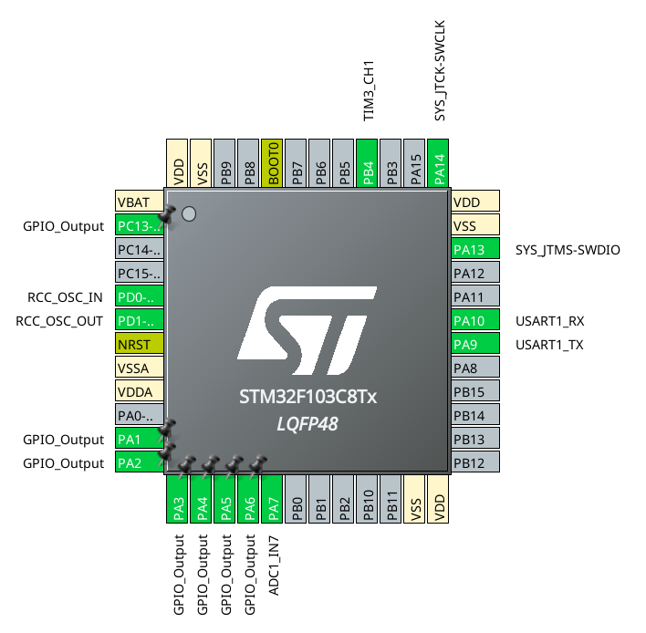
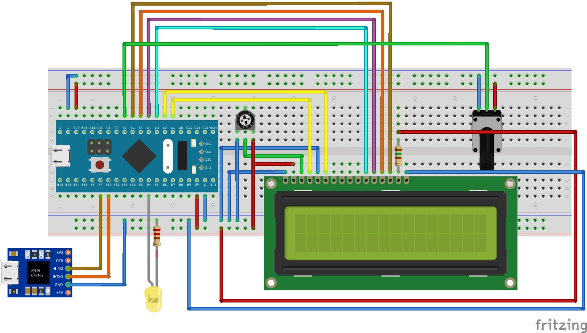

# Medidor de tensión extendido

Tiene como objetivo extender el funcionamiento del Medidor de Tensión para mostrar información a través de dos nuevas interfaces: PWM y UART. 

## Consignas

1. Configurar y programar una salida PWM del microcontrolador de modo que la entrada analógica por donde se mide la tensión varíe la intensidad de un LED externo a la placa. Utilice una escala lineal, de modo que para una entrada de tensión de cero volts (0V) el LED esté completamente apagado (ciclo de trabajo de la PWM: 0%), mientras que una entrada de 3,3 V se traduzca en un LED completamente encendido (ciclo de trabajo de la PWM: 100%). 
2. Enviar la información de tensión medida hacia una computadora a través de puerto serie en intervalos de 0,5 segundos. El formato debe ser:

> Tensión medida: x,xx V

Donde x,xx es el valor de tensión medido, que va de 0,00 V a 3,33 V.  

Configurar la comunicación serie con los siguientes parámetros: 9600 8N1, es decir, 9600 baudios, 8 bits de datos, sin bit de paridad, 1 bit de stop.

## Diagramas

### Pinout

### Breadboard

*Aclaraciones:*
1. El LED se puede conectar al reves, es decir, con su terminal largo a V+ y su terminal corto al BluePill. En este caso deberemos tener en cuenta que con 3.3v tendriamos maxima intensidad, al contrario de como solemos tratar un diodo LED.
2. En este diagrama, al modulo UART - USB le conectamos RX y TX, pero funciona solo con RX (dado que solo estaremos utilizando la funcion de recibir datos en UART).

## Codigo

Los archivos generales fueron generados con el programa [STM32Cube](https://www.st.com/en/development-tools/stm32cubemx.html). Luego se adapto el Makefile, y se agregaron las librerias para el display LCD provistos por la catedra. Siguiendo el proceso descrito en el **README.md** del directorio base.