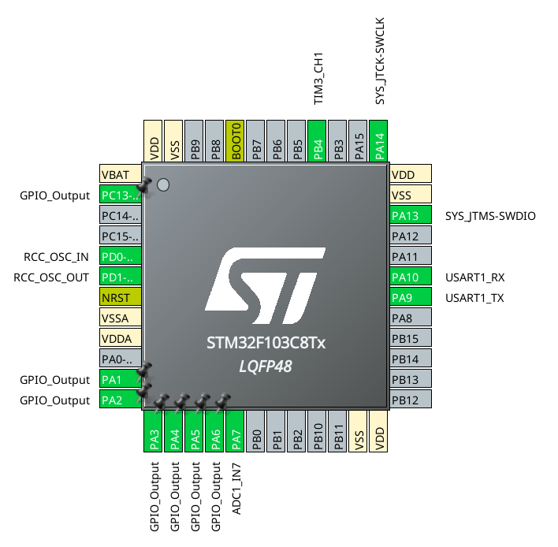
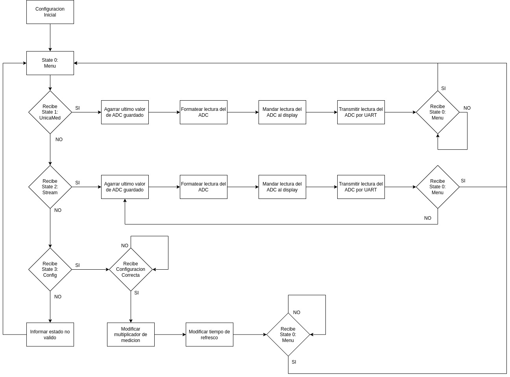

# Interacción con medidor de tensión

Tiene como objetivo Interactuar con el medidor de tensión a través de puerto serie.

## Consignas

Al encender, el sistema debe mostrar un mensaje de bienvenida a través del terminal serie.
A continuación de este, debe mostrar un menú, el cual constará de dos opciones:

```
*** MENU *** 

1. Mostrar último valor medido 
2. Mostrar valores medidos en tiempo real 
3. Ajustes 
```

- La opción 1 muestra el último valor medido, y vuelve a imprimir el menú. 
- La opción 2 mostrará los valores medidos a medida que vara realizando las mediciones. 
> Tensión medida: x,xx V 

Para finalizar y volver al menú debe enviar el caracter s. 

- La opción 3 permite ajustar: 
  - formato de tensión medida. Esta puede estar expresada en V o en mV. 
  - intervalo de medición expresado en ms. 

El mensaje a enviar al microcontrolador debe tener el siguiente formato: 
`[x,yyyy]`
donde:
- x puede ser 1 (tensión en V) o 2 (tensión en mV), 
- yyyy es el intervalo de medición expresado en ms. El valor puede ir de 5ms (0005) hasta 9999 ms (9999).
- En caso de ingresar un valor no válido, imprimir un mensaje por el terminal de la computadora, indicándolo con un mensaje.           

## Diagramas

### Pinout


### Circuito

### Flow


## Codigo

Los archivos generales fueron generados con el programa [STM32Cube](https://www.st.com/en/development-tools/stm32cubemx.html). Luego se adapto el Makefile,y se agregaron las librerias para el display LCD provistos por la catedra.